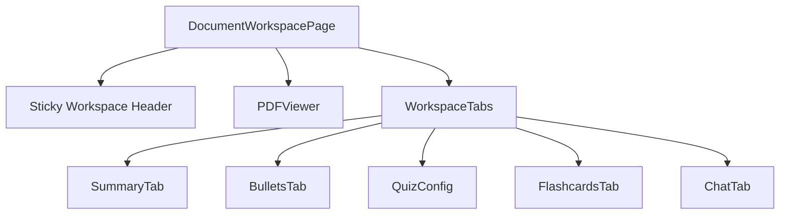

# SmartPDF AI: Interactive Course Study Workspace 🚀

SmartPDF AI is a premium, local-first interactive study workspace that transforms course materials (PDFs & DOCX files) into dynamic learning assets. It bridges document reading with AI-augmented learning modules through a synchronized, responsive layout.

The application operates in a **local-first anonymous mode** by default, storing documents and vector search indices locally in SQLite, making it extremely lightweight and secure without needing heavy Postgres or Redis dependencies for local development.

---

## ✨ Features

- **📂 Multi-format Ingestion**: Instant ingestion and text extraction for both `.pdf` and `.docx` documents.
- **⚡ In-Process Task processing**: Fallback to synchronous in-process tasks when Redis/Celery are offline.
- **🧠 Semantic Text Embeddings**: Uses LlamaIndex sentence splitting and SentenceTransformers (`BAAI/bge-large-en-v1.5`) for high-fidelity vector representation.
- **💬 Citation-Augmented RAG Chat**: Conversational AI assistant with click-to-navigate page citations. Clicking a citation jumps the PDF viewer to the correct page automatically.
- **📝 Automatic Learning Tools**:
  - **Summary**: Concise and chapter-by-chapter summaries.
  - **Revision Points**: Core concepts, definitions, and key formulas.
  - **Quiz**: Self-assessment multiple-choice (MCQs) and descriptive questions.
  - **Flashcards**: Quick-review front/back flashcard decks.
- **🎨 Premium Dark Theme**: Beautiful slate-dark UI with glassmorphic accents, backdrop blurs, and responsive layout scaling.

---

## 🏗️ Architecture & Component Hierarchy

The study workspace is built on Next.js 15 (App Router) and FastAPI, coordinated through a responsive layout:



- **DocumentWorkspacePage (`[id]/page.tsx`)**: Manages the synchronized page state between chat citations and the PDF canvas.
- **PDFViewer (`PDFViewer.tsx`)**: Canvas-rendered viewer supporting search, zooming, and text extraction.
- **ChatTab (`ChatTab.tsx`)**: Handles SSE streaming chat responses from the backend, parsing source citations into navigate-on-click buttons.

---

## 🛠️ Tech Stack

### Backend
- **Framework**: FastAPI (Python)
- **ORM/Database**: SQLAlchemy + SQLite (Local development) / PostgreSQL (Production)
- **Task Runner**: Celery (Optional)
- **Vector Search**: SQLite-based native vector storage & ChromaDB integrations
- **AI Processing**: HuggingFace SentenceTransformer, OpenAI API, or local Ollama instances

### Frontend
- **Framework**: Next.js 15 (React 19, TypeScript)
- **Styling**: Tailwind CSS
- **Icons**: Lucide React
- **Animations**: Framer Motion

---

## 🚀 Getting Started

### Prerequisites
- **Python**: v3.10 or higher
- **Node.js**: v18.0 or higher
- **OpenAI API Key** (Optional): Set in your environment to use OpenAI model generation, or use Ollama/intelligent mock fallbacks.

### Windows (Quick Start)
The project comes with a unified launch panel `run.bat`. Simply double-click `run.bat` or run:
```cmd
run.bat
```
The script will:
1. Detect and guide you to install any missing dependencies.
2. Initialize the Python virtual environment and run backend migrations.
3. Install frontend node modules.
4. Launch both the backend FastAPI server and the Next.js frontend in separate terminal windows.

---

### Manual Setup

#### 1. Setup Backend
Navigate to the `backend` directory:
```bash
cd backend
```

Create a virtual environment and activate it:
```bash
python -m venv venv
# On Windows:
call venv\Scripts\activate
# On Linux/macOS:
source venv/bin/activate
```

Install requirements:
```bash
pip install -r requirements.txt
```

Create your local `.env` configuration file:
```bash
cp .env.example .env
```
*(By default, `.env` is configured to run with SQLite `sqlite:///./test.db`, requiring no database setup).*

Start the FastAPI development server:
```bash
uvicorn app.main:app --reload --port 8000
```
- API Docs will be available at: http://localhost:8000/docs
- Healthy check at: http://localhost:8000/

#### 2. Setup Frontend
Navigate to the `frontend` directory:
```bash
cd frontend
```

Install dependencies:
```bash
npm install
```

Start the Next.js development server:
```bash
npm run dev
```
Open http://localhost:3000 to access the workspace.

---

## 📁 Repository Structure

```
├── backend/                  # FastAPI Application
│   ├── app/
│   │   ├── api/             # API Endpoints (documents, chat, quiz, etc.)
│   │   ├── db/              # SQLAlchemy Models & SQLite DB setup
│   │   ├── services/        # Embedder, Storage, LLM & RAG Engines
│   │   └── workers/         # Background tasks & schedulers
│   ├── migrations/          # Alembic migrations database scripts
│   ├── requirements.txt     # Python Dependencies
│   └── .env.example         # Example configuration settings
├── frontend/                 # Next.js Application
│   ├── app/                 # Next.js App Router Page layouts
│   ├── components/          # Reusable Workspace components (UploadZone, PDFViewer, Chat)
│   ├── tailwind.config.js   # Tailwinds aesthetics variables
│   └── package.json         # Node Dependencies
├── run.bat                   # Windows batch file launch panel
└── README.md                 # Project Documentation
```

---

## 🔒 License
This project is licensed under the MIT License. Feel free to use, modify, and distribute it.
