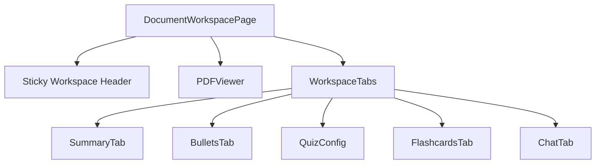
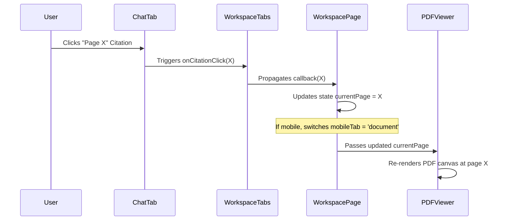

# SmartPDF AI: PDF Analyzer UI Implementation Spec

The user interface for the SmartPDF AI PDF Analyzer has been designed as a premium, highly interactive study workspace. It bridges the document reading flow with the AI-augmented learning modules through a synchronized, responsive layout.

---

## 🏗️ Architecture & Component Hierarchy

The workspace is built on Next.js using a responsive grid system and interactive React state loops:

*   **DocumentWorkspacePage (`[id]/page.tsx`)**: Manages workspace state including document metadata, the active page (`currentPage`), mobile tab toggle (`mobileTab`), collapsible side panel (`showRightPanel`), and file replacement upload triggers.
*   **PDFViewer (`PDFViewer.tsx`)**: Render engine using PDF.js. Handles Canvas-based pages, programmatic zooming, file replacements, page navigation, and in-document text search with index matching.
*   **WorkspaceTabs (`WorkspaceTabs.tsx`)**: Main layout for study tools, wrapping the summary, quiz, flashcards, and chat modules.
*   **ChatTab (`ChatTab.tsx`)**: Conversational RAG assistant. Houses message threads, streams answers, and renders citations that hook back into the PDF viewer.

---

## 📱 Breakpoint Layouts & Responsiveness

| Breakpoint | Layout Style | Left Column (PDF) | Right Column (Tools/Chat) | Special Interactions |
| :--- | :--- | :--- | :--- | :--- |
| **Desktop** ($\ge 1024\text{px}$) | Side-by-Side Split | `58%` width | `42%` width | Collapsible tools drawer to expand PDF to `100%` width. |
| **Tablet** ($768\text{px} - 1023\text{px}$) | Collapsible Split | `50%` width | `50%` width | Right panel defaults to visible, toggleable via an icon button. |
| **Mobile** ($< 768\text{px}$) | Tabbed Navigation | Full Screen (when active) | Full Screen (when active) | Bottom navigation bar toggles views; citation clicks auto-switch to PDF. |

---

## 🔗 Page Citation Integration

To enable a fluid reading and questioning flow, the chat and PDF viewer communicate via a centralized callback context:

This interaction guarantees that clicking an AI citation in any answer immediately jumps the user to the correct page of the document.

---

## 🔄 Live File Replacement Pipeline

Replacing a PDF document updates the workspace without losing context. The pipeline leverages FastAPI backend endpoints:

1.  **Selection**: The user clicks **Replace** in the PDFViewer toolbar or page header, triggering a hidden native file input.
2.  **Upload**: The selected file is posted to `/api/documents/upload`.
3.  **Visualization**: A modal overlay renders the step-by-step progress using `<ProcessingStatus>`:
    *   *Step 1*: Reading & Parsing PDF Text
    *   *Step 2*: Semantic Sentence Splitting
    *   *Step 3*: Generating Vector Embeddings
    *   *Step 4*: Vector Store & Indexing
    *   *Step 5*: Study Workspace Ready
4.  **Transition**: Once complete, the router transitions the user to the newly generated document workspace.

---

## 🎨 Design System & Aesthetics

*   **Theme**: Dark mode design utilizing a dark slate background (`#0B0B0F`), deep charcoal cards (`#12121A`), and subtle border dividers (`#1E1E2A`).
*   **Accents**: Electric purple (`#7C5CFF`) for workspace accents and cyan (`#00D4FF`) for actions, search alerts, and processing statuses.
*   **Glassmorphism**: Backdrop blur filters (`backdrop-blur-md`) on sticky menus and sidebar toolbars.
*   **Typography**: Clean sans-serif sans-serif font weights with semantic typography for maximum readability.
